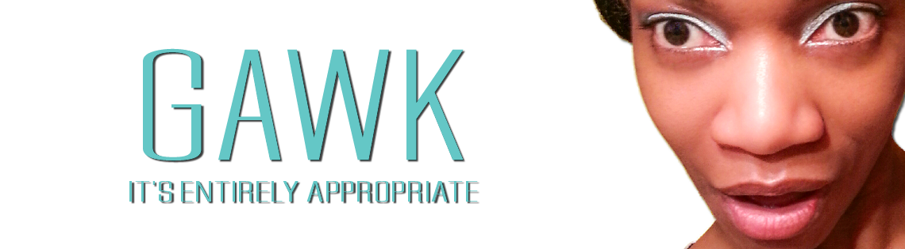

# latoniamertica.dev Digital Portfolio Gateway
## gateway to code life culture

*digital portfolio gateway created as 
access point for various online elements 
fleshing out portfolio for 
La'Tonia Mertica. .. access insight 
into my coding journey at <a href="https://www.linkedin.com/pulse/doneweek3-working-hard-la-tonia-mertica/" target="_blank">my
LinkedIn blog</a> ... solid exercise for intentional verbose code - image tags, inline style in image tag, title in image tag, setting urls to open in new page(s) with target value of _blank; adding audio; adding pdf, and presenting italic content in non-italic parentheses (script file)*

###### <a href="https://www.latoniamertica.dev/" target="_blank">visit digital portfolio gateway by/for La'Tonia Mertica</a>

**HOW WORKS**
 
a) click icon in left fixed bar to visit complementary online presence(s); 
b) visit code or deployed for homepage, portal, and backend of capstone project; 
c) scan QR Code to visit Trello board for planning insight; 
d) click play/pause to listen to audio clips from mock interviews 
**note:** conducted during Hack Upstate 'Careers in Code' full stack javascipt code/web dev bootcamp; 
e) click access resume to view; 
f) and hover for titles on most elements   

**NEXT STEP**
 
1. build section of featured projects to include image, brief description, link to test code, and link to deployed 
2. set media queries for optimized presentation on devices of various sizes from large to small

 

 

##### FIRST NAME: La'Tonia Mertica
###### note_1: pronounced *luh tone yuh merr treece*
 

## MY BACK STORY
 
I went into code because I saw code as a gateway to better options, informed risk-taking, and outcomes. 
 
 
My fantasies on a better life are nothing special. A better life, life quality, and sense of self. A life during which I create opportunities for the substance of my existence. A life I enthusiastically own. A life that welcomes, entertains, and bows to parts of myself I've envisioned embracing for too long - focusing on non-me things out of a sense of duty, and obligation, and misaligned timing. Nothing special. Still, my own, and true difference.  
 
 
When I was notified I was accepted into Hack Upstate full stack javascript code/web dev bootcamp Careers in Code, I knew my life was changed. 
 
 
Far from perfect, and likely destined to never truly achieve the level and status I fantasize on, I code every day. I apply my best self. Dwell in the moment - to moment. Never forget how hard life has been at times. And that debatably I shouldn't be alive today. But I am. Building out the purpose of my life is a lot to do - and I still don't have authenticated clarity on it. 
 
 
Still, it involves vigorous exceptional communication - and, coding is now part of my fierce means to say some things.
 
 

